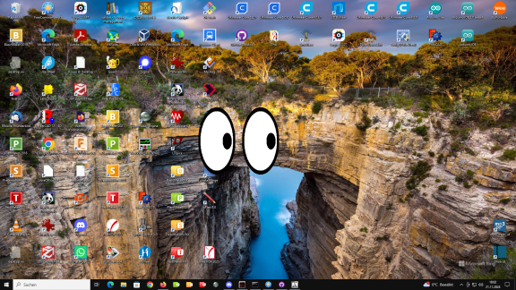

# euEyes
 A Xeyes lookalike for MS Windows

Eyes that follow your cursor on the desktop.

Originally programmed with Openeuphoria now ported to Phix (http://phix.x10.mx/).

# Usage:

Press and hold the left mouse button in the white of an eye to move the eyes.

Press the left mouse button in the black border of an eye to change the size.

Press the right mouse button in a pupil of an eye for a popup menu.

